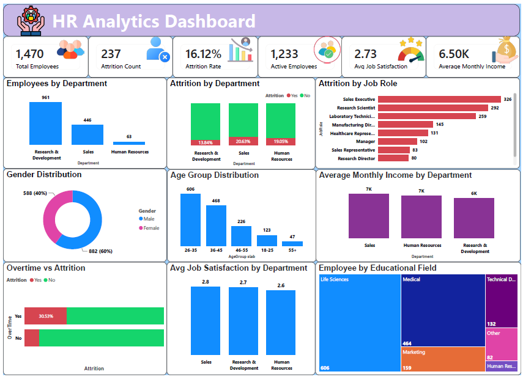

# HR Analytics Dashboard

## Overview
This project is an interactive HR Analytics Dashboard developed using Power BI. It helps analyze employee attrition, workforce demographics, and key HR metrics through interactive visualizations.

## Tools Used
- Power BI
- Power Query
- DAX
- Microsoft Excel

## Features

- Interactive HR Analytics Dashboard built using Power BI.
- KPI cards displaying:
  - Total Employees
  - Active Employees
  - Attrition Count
  - Attrition Rate
  - Average Job Satisfaction
  - Average Monthly Income
- Department-wise employee distribution.
- Department-wise attrition analysis.
- Job role-wise attrition analysis.
- Gender distribution visualization.
- Employee age group distribution.
- Average monthly income by department.
- Overtime vs Attrition analysis.
- Average job satisfaction by department.
- Education field-wise employee distribution.
- Interactive filtering using slicers.
- Data cleaning and transformation using Power Query.
- Custom DAX measures for KPI calculations.

## Dataset
The dataset contains employee information such as department, age, gender, education, salary, and attrition status.

## Dashboard Preview

## Files

- HR Analysis Dashboard.pbix – Power BI report
- HR_Analytics.xlsx – Sample dataset
- Dashboard.png – Dashboard screenshot

## Skills Demonstrated
- Data Cleaning
- Data Modeling
- DAX Measures
- Interactive Dashboard Design
- Business Insights

## Author
Santhoshkumar V
